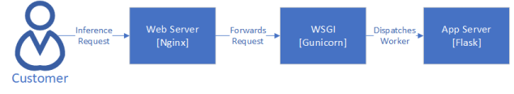
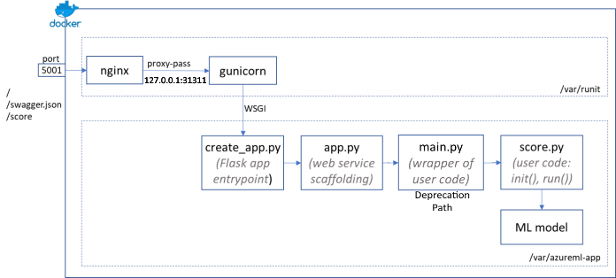

# Base Image Network Stack Overview

## Request Flow

An inference request hitting the base image currently goes through the following network stack:

#### High Level Request Flow

#### Base Image Structure

> **Note:** The [main.py](https://msdata.visualstudio.com/Vienna/_git/AzureMlCli?path=%2Fsrc%2Fazureml-core%2Fazureml%2F_model_management%2Fdata%2Fmain_template.txt&_a=contents&version=GBmaster) is not included when leveraging MMS's REST api, however it is still included when using the AML SDK.

### Web Server - [Nginx](https://www.nginx.com/resources/glossary/nginx/)

The web server layer is in charge of handling connection coming in from the internet and serving static/cached data in order to reduce the load on the underlying application server.

We leverage Nginx to do the following:

- Optimized to handle large amount of requests.
- Handles [slow connections](https://www.brianstorti.com/the-role-of-a-reverse-proxy-to-protect-your-application-against-slow-clients/), such as clients sending big requests or having slow internet.

Once the request goes through Nginx, it is then forwarded to the the layer, the web server gate interface.

### Web Server Gateway Interface (WSGI) - [Gunicorn](https://gunicorn.org/)

A web server gateway interface, or WSGI, interfaces the web server with the underlying application server. It can be thought of a dispatcher service which given a request will dispatch a worker thread of the application server.

Gunicorn is a Python WSGI HTTP server that leverages 'pre-fork' worker model to efficiently handle multiple requests in parallel.

#### Why do we need Gunicorn?

Conceptually, flask is a programming framework, not a web server. This means that running a web service leveraging Flask's built-in development server is not a [good practice](https://flask.palletsprojects.com/en/1.1.x/tutorial/deploy/#run-with-a-production-server) in production systems since it is not adapted handle large scales. By leveraging Gunicorn, we can can handle incoming requests in parallel through dispatching workers which runs their own flask application.

In other words, without Gunicorn, flask handles requests 1 by 1. With GUnicorn, workers are spun up with their own flask app, which then enables processing requests in parallel (every worker thread having their own flask app).

#### What is a pre-fork worker model?

A Pre-forking worker model basically means some [master](https://docs.gunicorn.org/en/stable/design.html#master) creates worker forks which will handle each individual requests. A worker fork is a completely separate *nix process. The master in itself does **not** handle the requests - it is merely responsible of keeping the configured amount of workers up and running.

#### Who dispatches the requests?

Given the master does not process the incoming requests, the requests are load-balanced by the underlying [kernel](https://docs.gunicorn.org/en/stable/design.html#how-many-workers). This means that all worker processes are listening to the same port and requests forwarded to this port by Nginx will be distributed.

##### Pre-forking in Base Images

Gunicorn allows the control of the amount of the requests processed through the `workers` & `threads` [configuration](https://docs.gunicorn.org/en/stable/settings.html#worker-processes), where the workers sets the number of individual worker processes are spun up, and threads being the amount of threads per workers handled.

Currently, the base images are set at 1 default worker & 1 thread in both [synchronous](https://msdata.visualstudio.com/Vienna/_git/o16n-base-images?path=%2Fsrc%2Fcommon%2Fserver%2Fsynchronous%2Fgunicorn_conf.py&_a=contents&version=GBmaster) & [asynchronous](https://msdata.visualstudio.com/Vienna/_git/o16n-base-images?path=%2Fsrc%2Fcommon%2Fserver%2Fasynchronous%2Fgunicorn_conf.py&_a=contents&version=GBmaster) configuration settings. 

> **Note:** The amount of workers can be overridden by the customer through setting the WORKER_COUNT environment variable.

### Application Server - [Flask](https://flask.palletsprojects.com/)

The application server is where work is actually done in order to process the request.

In our case, we leverage flask to call the customer's score.py, which in turn infers the call leveraging their model.
